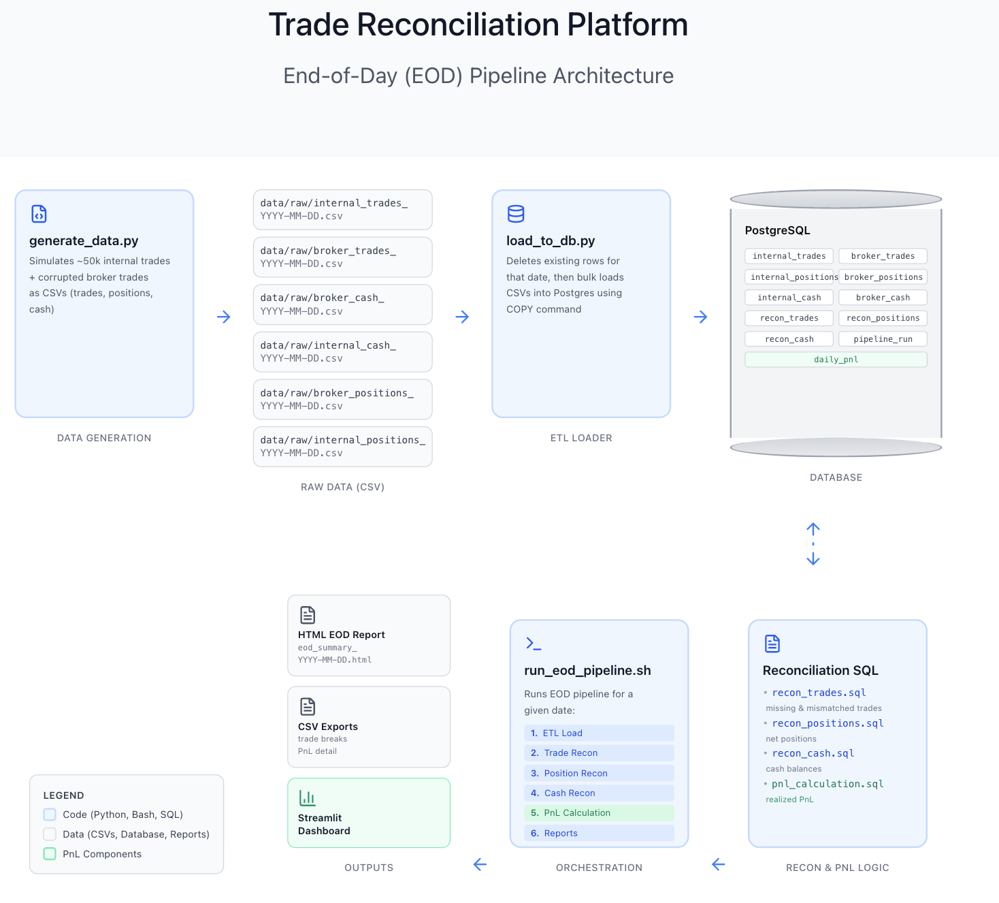
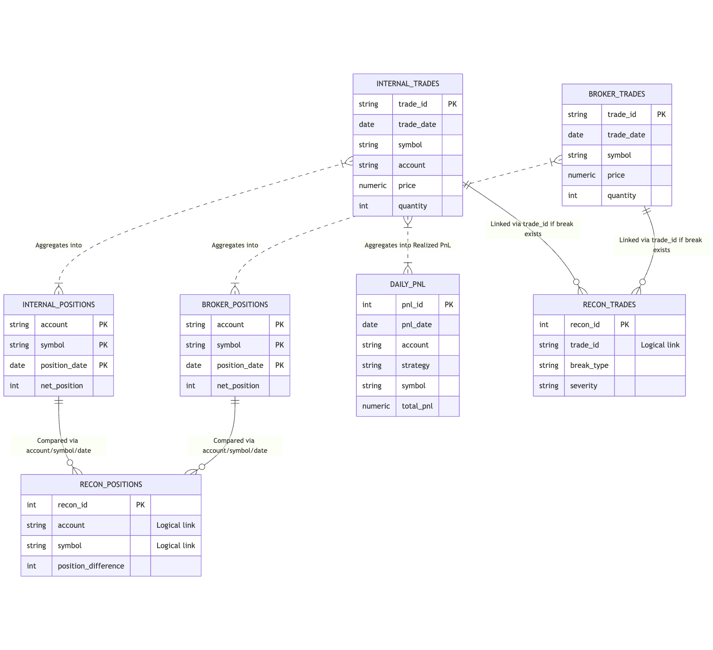

# Trading Operations Reconciliation Platform

This is an end-to-end simulation of a daily trading operations workflow. It functions as a T+0 reconciliation engine that ingests synthetic trade logs from an "internal" system and an external "broker", normalizes them in PostgreSQL, runs SQL-based logic to detect breaks, and calculates daily PnL.

I built this project to understand the engineering and operational challenges of the Middle Office—specifically how financial firms ensure their internal books match external records to prevent financial loss and settlement failure.



---

## Table of Contents
1. [Project Overview](#project-overview)
2. [Technical Features](#technical-features)
3. [Database Schema](#database-schema)
4. [Reconciliation Logic](#reconciliation-logic)
5. [Example Outputs](#example-outputs)
6. [Project Structure](#project-structure)
7. [How to Run](#how-to-run)

---

## Project Overview

The system simulates a high-volume environment (50,000+ daily trades) where data discrepancies are inevitable. It focuses on **Operational Resilience**—ensuring that the system can detect errors and be safely re-run if data changes.

### Core Objectives
- **Data Modeling:** Designing a normalized schema for trades, positions, and cash.
- **SQL-First Logic:** Implementing complex join logic (Anti-Joins) in the database layer rather than Python for auditability and performance.
- **Idempotency:** Building a pipeline that cleans up partial states before running, allowing for safe re-processing of historical dates.

---

## Technical Features

* **Synthetic Data Generation:** Python scripts generate realistic trade logs with attributes like Strategy, Venue, and Fee structures. It injects probabilistic errors (e.g., 1% price mismatches, 0.5% missing trades) to test the recon engine.
* **High-Performance ETL:** Uses the PostgreSQL `COPY` protocol to bulk-load 50,000 rows in under 2 seconds, simulating low-latency requirements.
* **3-Way Reconciliation:**
    * **Trade Level:** Matches individual executions on Symbol, Quantity, Price, and Settlement Date.
    * **Position Level:** Aggregates net positions per account/symbol to catch booking errors.
    * **Cash Level:** Reconciles net cash balances per currency to ensure liquidity accuracy.
* **Automated Reporting:** Generates an HTML Executive Summary and detailed CSV break files for analyst investigation.

### Tech Stack
* **Database:** PostgreSQL 14+
* **Language:** Python 3.10+ (Pandas, SQLAlchemy, Streamlit)
* **Orchestration:** Bash scripting for End-of-Day (EOD) sequencing

---

## Database Schema

The database is normalized to separate the "Source of Truth" (Internal) from "External Data" (Broker). The `recon_trades` table acts as an exception log, linking back to the source tables via `trade_id`.



---

## Reconciliation Logic

I implemented the core business logic in SQL to leverage the database engine for heavy lifting.

### 1. Trade Reconciliation
The engine detects 6 distinct break types by joining `internal_trades` and `broker_trades`.

* **Missing Trades (Execution Risk):** Uses Left/Right Anti-Joins to find trades present in one system but missing in the other.
* **Economic Mismatches:** Inner Joins that flag discrepancies in Price, Quantity, or Fees.
* **Settlement Mismatches:** specifically checks `settlement_date` to prevent liquidity breaks (e.g., Internal T+1 vs Broker T+2).

**Example Logic (Missing Internal Trades):**
```sql
INSERT INTO recon_trades (recon_date, trade_id, break_type, severity, ...)
SELECT
    :recon_date,
    b.trade_id,
    'MISSING_IN_INTERNAL',
    CASE WHEN ABS(b.quantity * b.price) > 100000 THEN 'CRITICAL' ELSE 'MEDIUM' END
FROM broker_trades b
LEFT JOIN internal_trades i ON b.trade_id = i.trade_id
WHERE b.trade_date = :recon_date
  AND i.trade_id IS NULL;

```

### 2. PnL Attribution

The system calculates **Realized PnL** based on the verified internal trades. It attributes profit to specific strategies (e.g., Market Making vs. Delta Neutral).

```sql
SELECT 
    strategy,
    SUM(CASE WHEN side = 'BUY' THEN -1 * (quantity * price)
             ELSE (quantity * price) END) AS realized_pnl
FROM internal_trades
GROUP BY strategy;

```

---

## Example Outputs

Below are actual outputs from a simulation run of **50,000 trades** for date `2026-02-01`.

### 1. Trade Break Summary (CLI)

The system detected 2,893 breaks. The "CRITICAL" breaks represent missing trades with a high notional value, requiring immediate attention.

```text
BREAK TYPE                | SEVERITY   | COUNT    | TOTAL $         | AVG $
---------------------------------------------------------------------------
MISSING_IN_BROKER         | CRITICAL   | 458      | $526,553,334.79 | $1,149,679.77
MISSING_IN_INTERNAL       | CRITICAL   | 231      | $268,819,780.05 | $1,163,721.99
QTY_MISMATCH              | MEDIUM     | 169      | $  511,357.45 |$    3,025.78
SETTLEMENT_MISMATCH       | MEDIUM     | 485      | $        0.00 |$       0.00
FEE_MISMATCH              | LOW        | 959      | $      479.11 |$       0.50

```

### 2. Position Reconciliation

After reconciling trades, the system aggregates positions to ensure the books are flat.

```text
POSITION RECONCILIATION REPORT
===========================================================================
BREAK TYPE                | SEVERITY   | COUNT    | TOTAL DIFF   | AVG DIFF
---------------------------------------------------------------------------
POSITION_MISMATCH         | CRITICAL   | 35       |      367,459 |  10,498.83
POSITION_MISMATCH         | HIGH       | 5        |        2,515 |     503.00

```

### 3. PnL Detail

A snapshot of the daily performance by strategy.

```text
STRATEGY             | SYMBOLS  | TRADES   | NET PNL
---------------------------------------------------------------------------
DeltaNeutral         |       10 |    12465 | $ 31,227,063.86
StatisticalArb       |       10 |    12568 | $-120,430,990.46
LiquidityProv        |       10 |    12517 | $-149,715,692.42
MarketMaking         |       10 |    12450 | $-162,748,424.43

```

---

## Project Structure

```text
trade-ops-recon-platform/
  sql/
    schema.sql               # Database definition and indexing
    recon_trades.sql         # Trade-level break logic (Anti-Joins)
    recon_positions.sql      # Position aggregation logic
    recon_cash.sql           # Cash balance logic
    pnl_calculation.sql      # Realized PnL logic

  src/
    generate_data.py         # Synthetic data generation with error injection
    load_to_db.py            # High-performance ETL (Postgres COPY)
    reconcile_trades.py      # Reconciliation engine wrapper
    calculate_pnl.py         # PnL engine wrapper
    generate_reports.py      # Static HTML report generation
    dashboard.py             # Interactive Streamlit visualization

  scripts/
    run_eod_pipeline.sh      # Main orchestration script

```

---

## How to Run

### 1. Prerequisites

* PostgreSQL installed and running locally.
* Python 3.10+.

### 2. Setup

```bash
# Clone the repo
git clone https://github.com/jessicabat/trade-ops-recon-platform.git
cd trade-ops-recon-platform

# Create virtual environment
python -m venv .venv
source .venv/bin/activate

# Install dependencies
pip install -r requirements.txt

# Initialize Database
createdb trade_ops_recon
psql -d trade_ops_recon -f sql/schema.sql

```

### 3. Run the Simulation

To generate fresh data for a specific date and run the end-to-end pipeline:

```bash
# 1. Generate synthetic data
python src/generate_data.py

# 2. Run the EOD Pipeline (Load -> Recon -> PnL -> Report)
./scripts/run_eod_pipeline.sh 2026-02-01

```

### 4. Visualizing Results

You can view the results via the generated HTML report in `data/processed/eod_reports/` or launch the interactive dashboard:

```bash
streamlit run src/dashboard.py

```